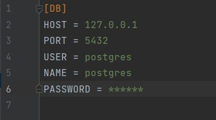
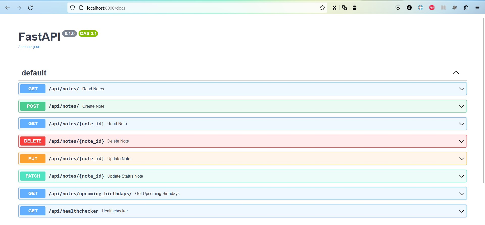

# GoIT_WEB_HW_11
Individual homework №11 at GoIT school

<div>
  <a href="https://www.python.org" target="_blank">
    
  </a>
  &nbsp;&nbsp;&nbsp;&nbsp;
  <a href="https://fastapi.tiangolo.com" target="_blank">
    
  </a>
  &nbsp;&nbsp;&nbsp;&nbsp;
  <a href="https://www.postgresql.org" target="_blank">
    
  </a>
  &nbsp;&nbsp;&nbsp;&nbsp;
  <a href="https://www.sqlalchemy.org" target="_blank">
    
  </a>
  &nbsp;&nbsp;&nbsp;&nbsp;
  <a href="https://www.docker.com" target="_blank">
    
  </a>
</div>


## Description

The project provides a RESTful API for managing your contacts. In this repository, you will find functionalities for creating, retrieving, updating, and deleting contacts, as well as searching for contacts by name, last name, or email address.

## Functionalities

### Create Contact
Users can create a new contact by providing information about their first name, last name, email address, phone number, birthday, and position.

### Get List of Contacts
Users can retrieve a list of all contacts, including information about each contact such as first name, last name, email address, and birthday.

### Get Contact by Identifier
Users can retrieve information about a specific contact by providing its identifier.

### Update Contact (using both **PUT** and **PATCH** methods)
Users can update information about an existing contact, including its first name, last name, email address, phone number, birthday, and position.

### Delete Contact
Users can delete an existing contact by providing its identifier.

### Search Contacts by Name, Last Name, or Email Address
Users can search for contacts by entering a partial first name, last name, or email address. The API will return a list of contacts matching the entered query.

### Get List of Contacts with Upcoming Birthdays
Users can retrieve a list of contacts whose birthdays will occur within the next n days. By default, n is set to 7 days.

## Running the Project

To run the project on your computer, follow these steps:

1. Clone the repository:
   ```
   git clone https://github.com/S-Stepanov-1/GoIT_WEB_HW_11.git
   ```

2. Install dependencies:
   ```
   cd GoIT_WEB_HW_11
   poetry install
   ```

3. Create a `config.ini` file in the `GoIT_WEB_HW_11` folder and specify the settings for connecting to the PostgreSQL database:

### config.ini


4. Run a Docker container with PostgreSQL database or use analog:
    ```
    docker run --name contacts_postgres -p 5432:5432 -e POSTGRES_PASSWORD=your own password -d postgres
    ```

5. Perform migrations to create tables in the database:
   ```
   alembic upgrade head
   ```

6. Start the server:
   ```
   uvicorn main:app --host localhost --port 8000 --reload  
   ```

You can now access the API by making requests to 
    ```
    http://localhost:8000
    ```

## Request Examples

Examples of requests and responses for all the functionalities described above can be found in the [API documentation](http://localhost:8000/docs).
### API


## Conclusion

The **GoIT_WEB_HW_11** project provides a convenient way to manage contacts and their birthdays through a RESTful API. Follow the instructions above to deploy the project on your computer and start using its functionalities. If you have any questions, feel free to reach out to the project author.
